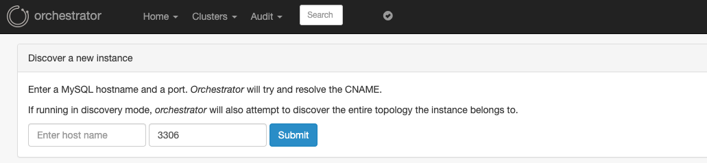
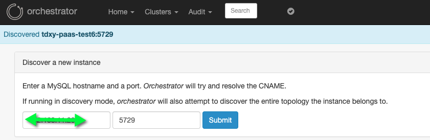

## discover机制

### discover页面

- WEB页面




- Templates代码

  位置在resource/templates/discover.tmpl，其核心是一个表单，对应两个text字段，以及加载一个js代码

  ```javascript
  <script src="{{.prefix}}/js/discover.js"></script>
  ```

  其主要是调用/api/discover/hostname/port接口，然后进行页面渲染(在discover.js:discover(hostname，port)函数中实现)



这里消息的通知是调用resources/public/js/orchestrator.js中的addAlert函数实现，其是在resources/templates/layout.tmpl中的div

```html
<div id="alerts_container"></div>
```

- resource以及layout加载方式

  在go/app/http.go:standardHttp中实现

  ```go
  	m.Use(render.Renderer(render.Options{
  		Directory:       "resources",
  		Layout:          "templates/layout",
  		HTMLContentType: "text/html",
  	}))
  	m.Use(martini.Static("resources/public", martini.StaticOptions{Prefix: config.Config.URLPrefix}))
  ```
指定加载templates文件、js文件

### discover API